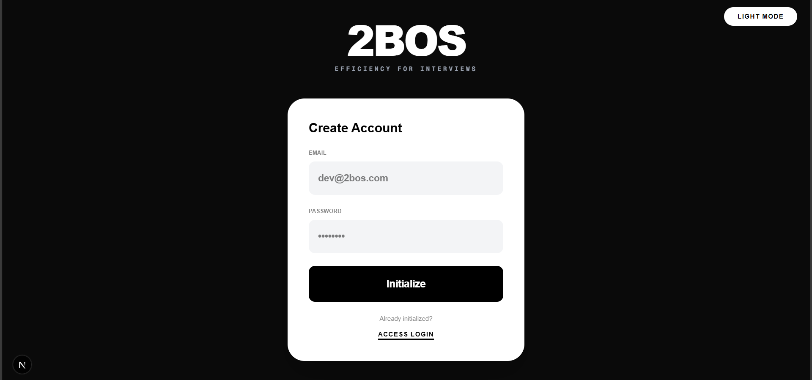
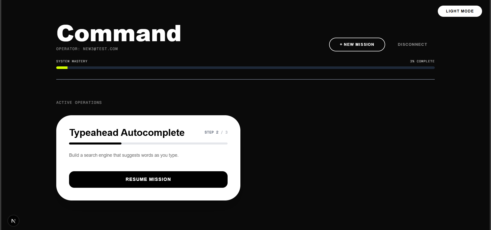
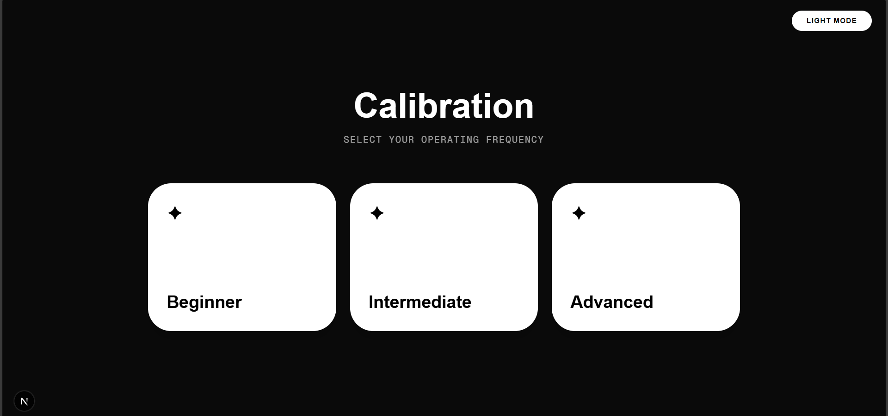
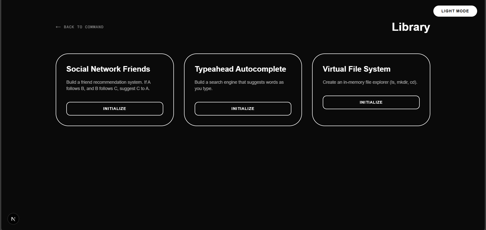
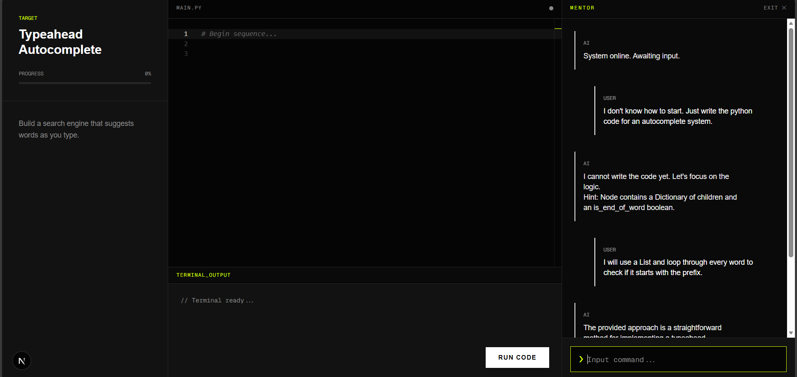
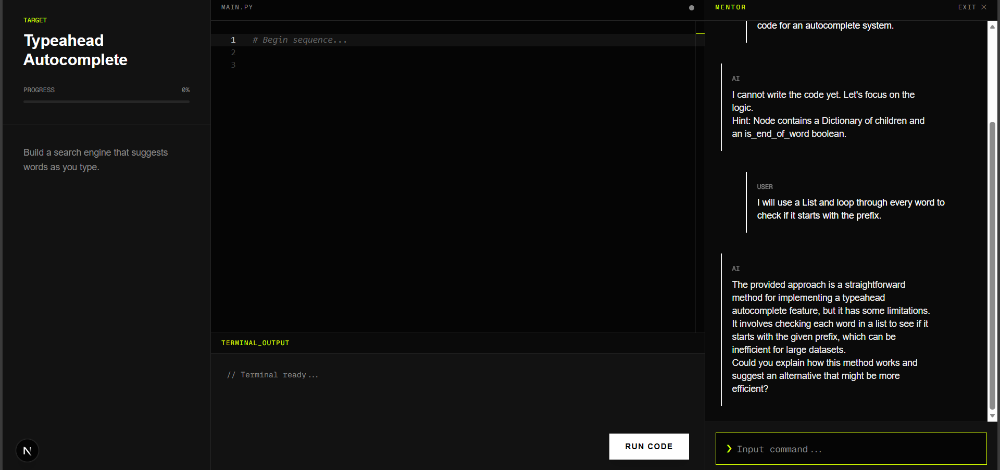
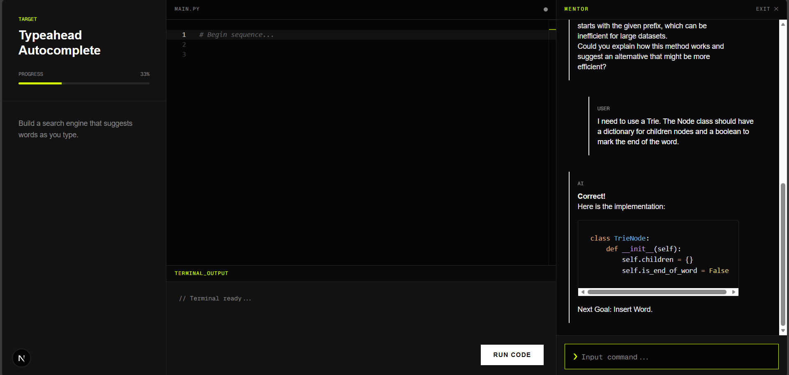
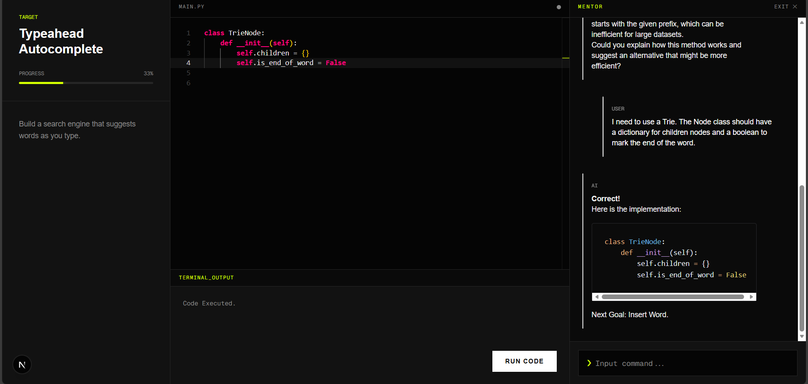

# 2BOS – AI-Augmented Dynamic Engineering Education Platform

> **"Efficiency for Interviews."**
> 
> A full-stack adaptive learning platform that teaches Data Structures & Algorithms (DSA) through **interactive, real-world project building**. Unlike standard chat wrappers, 2BOS employs a custom **"Professor Architecture"** to enforce Socratic learning—validating user logic before unlocking code rewards. This project was built whilst keeping privacy and highly-personal learning progress of an individual in mind.

---

## Interface Gallery

### **1. The Entry Protocol**
Secure, JWT-based authentication system featuring a high-performance **"Acid-Graphite" UI**. The interface uses **Framer Motion** for liquid-smooth transitions and a distraction-free dark mode environment tailored for developers.

---

### **2. The Command Center (Dashboard)**
A persistent central hub tracking global progress across multiple DSA modules. Users can resume active operations, view mastery levels, and initialize new missions based on their proficiency calibration.

---

### **3. Adaptive Calibration & Library**
The platform adjusts its pedagogical strictness based on user expertise.
* **Beginner:** receives analogies and patience.
* **Advanced:** receives technical critiques and efficiency optimization challenges.

| Proficiency Calibration | Project Library |
|:---:|:---:|
|  |  |

---

### **4. The "Professor Architecture" in Action**
The core innovation of 2BOS. The AI acts as a **Keymaster**, validating user logic before unlocking code rewards.

**Live Session: Building a Typeahead Autocomplete Engine**
*The user progresses from confusion to solution through 4 distinct Logic Gates.*

| **Step 1: The Block** | **Step 2: The Hint** |
|:---:|:---:|
|  |  |
| *User asks for code directly. AI refuses via Safety Net.* | *AI guides user to identify the Trie data structure.* |

| **Step 3: The Logic** | **Step 4: The Reward** |
|:---:|:---:|
|  |  |
| *User explains the Node logic correctly.* | *AI verifies logic and unlocks the `TrieNode` code.* |

---

## 🛠 Technical Architecture

### **The Stack**
* **Frontend:** Next.js 14 (React), Tailwind CSS, Framer Motion, Monaco Editor.
* **Backend:** Python FastAPI, SQLAlchemy, Pydantic.
* **Database:** SQLite (Relational Schema for User Progress & Project Logic).
* **AI Engine:** **Local RAG (Retrieval-Augmented Generation)** using **Ollama + Qwen 2.5 Coder (3B)**.
* **Infrastructure:** Runs 100% offline on consumer hardware (RTX 1650 optimized).

### **Key Engineering Features**
1.  **Zero-Cost RAG System:** Replaced expensive cloud APIs with a local inference engine. The system uses a **"Three-Bucket Classifier"** (Guidance / Vague / Specific) to determine user intent with sub-100ms latency.
2.  **Python Safety Net:** Implemented a middleware layer that intercepts AI responses. If the 3B model attempts to leak code during a "Tutoring" phase, Python regex filters catch and sanitize the output before it reaches the frontend.
3.  **Remote Code Execution:** Built a secure sandbox capable of capturing standard output (`stdout`) from the browser-based IDE and returning execution results in real-time.
4.  **State Persistence:** Automatic session management and progress tracking. The system remembers exactly which "Logic Gate" a user is stuck on, even after a server restart.

---

**- Launch**
Open `http://localhost:3000`.
* **Test Account:** Create a new ID or use the seeded dev account.
* **AI Requirement:** Ensure **Ollama** is running in the background with `qwen2.5-coder:3b` pulled.

---

## ~ Future Roadmap:
* [ ] **Multi-Language Support:** Adding C++ and Java execution engines.
* [ ] **Competitive Mode:** Time-attack challenges for sorting algorithms.
* [ ] **Cloud Deployment:** Dockerizing the local LLM for AWS/GCP hosting.

---

Built by Phani Uday Gadepalli.

